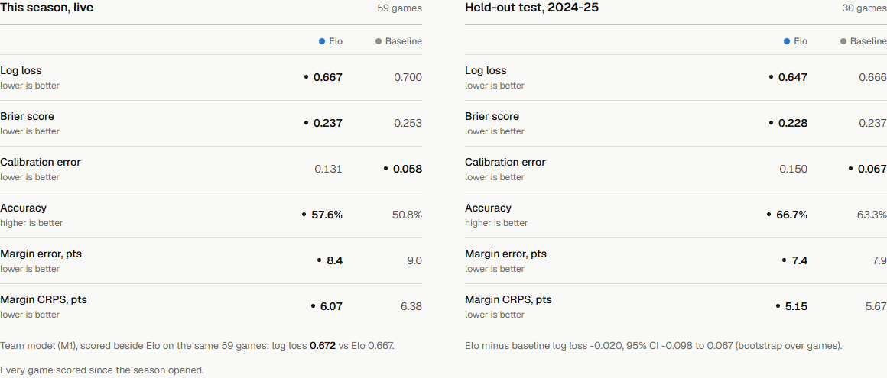
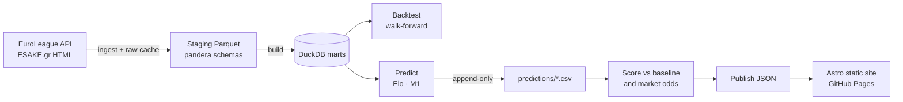

# EuroHoops Analytics

**Every EuroLeague and Greek Basket League game of 2026-27, forecast before tip-off, logged in public, and scored afterwards. No retroactive edits.**

[](https://github.com/straf10/EuroHoops-Analytics/actions/workflows/ci.yml)
[](https://github.com/straf10/EuroHoops-Analytics/actions/workflows/daily.yml)


### → [**Open the live site**](https://straf10.github.io/EuroHoops-Analytics/)



---

## Why this project exists

Most sports-prediction projects report a backtest, and a backtest is easy to flatter: tune a
little, re-run, keep the best number. EuroHoops is built so that it can't do that.

- **Pre-registered.** Every forecast is committed to [`predictions/`](predictions/) by a GitHub
  Actions bot *before* the game starts. The logs are append-only, and git history is the
  timestamp. A forecast that reached the log after tip-off is shown, flagged and left unscored.
- **Scored against a baseline in public.** Each model is measured against a home-win baseline
  and, for the EuroLeague, against bookmaker odds recorded before each game ([`odds/`](odds/)), on log loss, Brier,
  accuracy and margin error. Bad weeks stay on the scorecard.
- **Leak-free by construction.** Walk-forward backtests use warm-up, tuning, validation and test
  seasons that never overlap. Dedicated leakage tests check that no feature can see the game it
  predicts.
- **Fully automated.** One cron job runs ingest, build, predict, score and publish, then
  redeploys the site every morning at 08:00 UTC. No manual steps.

## What's inside

| | |
|---|---|
| 🏀 **Two live forecasting models** | A FiveThirtyEight-style **MOV-adjusted Elo** and **M1**, a possession-based team-efficiency model ([model card](docs/models/m1.md)) that also forecasts game totals |
| 🎯 **Shot-quality model** | **M2**, an expected-points-per-shot model (LightGBM vs. a spline baseline, isotonic calibration) that powers the shot charts ([model card](docs/models/m2.md)) |
| 📊 **20 seasons of EuroLeague stats** | Player and team pages from 2007-08 to today: game logs, per-36 / per-100 views, leaders, a five-player **Compare**, shot charts and a Shots explorer |
| 🧬 **Shot Profile Twin** | Matches a player's last *X* games against every EuroLeague player-season since 2007-08 to find who shot the same way |
| 🇬🇷 **Greek Basket League** | Scraped from ESAKE.gr HTML (politely throttled and fully cached), with play-by-play used to fill gaps in the box scores |
| 🏆 **Standings engine** | 2026-27 competition formats with the official tie-break rules |

## Results so far

Out-of-sample **test seasons** from the committed walk-forward backtests. Lower is better for
log loss; the baseline always picks the home team at its historical rate.

| Competition | Model | Test seasons | Games | Log loss | Accuracy | Margin MAE |
|---|---|---|---:|---:|---:|---:|
| EuroLeague | **M1** | 2024-25, 2025-26 | 732 | **0.623** | 63.3% | **9.09** |
| EuroLeague | Elo | 2024-25, 2025-26 | 732 | 0.625 | 63.8% | 9.12 |
| EuroLeague | Home baseline | 2024-25, 2025-26 | 732 | 0.660 | 62.8% | 9.67 |
| GBL | **M1** | 2024-25, 2025-26 | 340 | 0.484 | 75.0% | **9.39** |
| GBL | Elo | 2024-25, 2025-26 | 340 | **0.480** | 75.9% | 9.68 |
| GBL | Home baseline | 2024-25, 2025-26 | 340 | 0.668 | 61.5% | 12.42 |

M1 also cuts the totals error from 14.6 to 13.5 points in the EuroLeague. Every number above
comes from [`reports/`](reports/) (`backtest_elo*.json`, `backtest_m1*.json`), and the live
2026-27 scorecards (`live_scorecard*.json`) are updated each day.

> This is a model benchmark, not betting advice.

## How it works



| Stage | Code | Output |
|---|---|---|
| ingest | [`ingest/`](src/eurohoops/ingest/) (EuroLeague API, ESAKE.gr HTML) | raw response cache |
| parse | [`parse/`](src/eurohoops/parse/) (games, box scores, shots, possessions, stints, …) | staging Parquet |
| build | [`marts.py`](src/eurohoops/marts.py) | `data/marts/eurohoops.duckdb` |
| model | [`models/`](src/eurohoops/models/) (Elo, M1, M2), [`standings.py`](src/eurohoops/standings.py) | — |
| eval | [`eval/`](src/eurohoops/eval/) (backtests, scorecards, MLflow tracking) | `reports/*.json` |
| predict | [`predict.py`](src/eurohoops/predict.py), [`live_m1.py`](src/eurohoops/live_m1.py) | `predictions/*_2026-27.csv` |
| odds | [`odds.py`](src/eurohoops/odds.py) (The Odds API) | `odds/*.csv` (append-only) |
| publish | [`publish.py`](src/eurohoops/publish.py) → [`web/`](web/) | static site |

**Stack:** Python 3.12 · uv · DuckDB · pandas · pandera · LightGBM · Optuna · MLflow · httpx +
tenacity · Typer · Astro · GitHub Actions · GitHub Pages

## Engineering quality

- **447 tests** and a **≥85% coverage gate** (currently ~96%), plus mypy, ruff and vulture
  dead-code checks on every push.
- **Schema contracts:** pandera validates every staging table, and box-score invariants are
  checked on each build.
- **Reproducible:** fixed seeds, deterministic LightGBM, and bootstrap confidence intervals on
  every model comparison.
- **A polite scraper:** at least 2 s between ESAKE requests, every raw page cached and never
  fetched twice, and exponential backoff on rate limits.
- **Design system:** the site follows one documented design system,
  [*The Quiet Reference*](docs/DESIGN.md). It works at phone width in light and dark themes,
  and colour is never the only way hit/miss is shown.

## Run it locally

```bash
uv sync
uv run eurohoops ingest && uv run eurohoops ingest --competition gbl
uv run eurohoops build
uv run eurohoops predict && uv run eurohoops predict --competition gbl
uv run eurohoops publish

cd web && npm ci
npm run dev      # http://localhost:4321/EuroHoops-Analytics/
```

`backtest` re-tunes the models and rewrites the reports, and `score` rebuilds a scorecard. Each
takes `--competition gbl` where it applies. `ingest --details` also caches box scores,
play-by-play and shots. The first GBL ingest reads ~350 ESAKE pages at 2 s each; later runs only
refresh unfinished rounds.

<details>
<summary>Checks (the same ones CI runs)</summary>

```bash
uv run ruff check . && uv run ruff format --check .
uv run mypy src
uv run pytest -q --cov=eurohoops --cov-fail-under=85
uv run vulture src vulture_whitelist.py --min-confidence 60
```
</details>

## Documentation

| | |
|---|---|
| [`docs/PLAN.md`](docs/PLAN.md) | Roadmap and current priorities |
| [`docs/PRODUCT.md`](docs/PRODUCT.md) | Product brief: audience, evidence, principles |
| [`docs/DESIGN.md`](docs/DESIGN.md) | Front-end design system |
| [`docs/CONTEXT.md`](docs/CONTEXT.md) | Domain glossary |
| [`docs/models/`](docs/models/) | Model cards (Elo, M1, M2) |
| [`docs/data/`](docs/data/) | Data documentation (shots, possessions, stints, odds, GBL) |
| [`docs/history/`](docs/history/) | Build record: the prompts, progress and close-out notes cited as pre-registration evidence |

## Repository layout

```
src/eurohoops/     pipeline code (ingest, parse, models, eval, predict, stats)
web/               Astro static site
tests/             pytest suite
docs/              product, design, model and data docs, build history
predictions/       append-only pre-registered forecast logs
odds/              append-only market benchmark logs
reports/           backtests, scorecards, QA checks (pre-registration evidence)
```

## License

All rights reserved; see [`LICENSE`](LICENSE). The repository is public for portfolio and
reference purposes and is not licensed for reuse.
