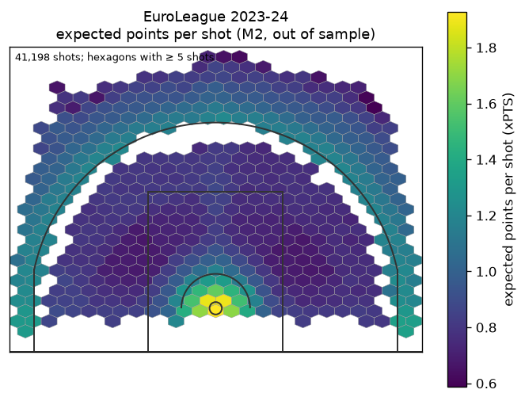
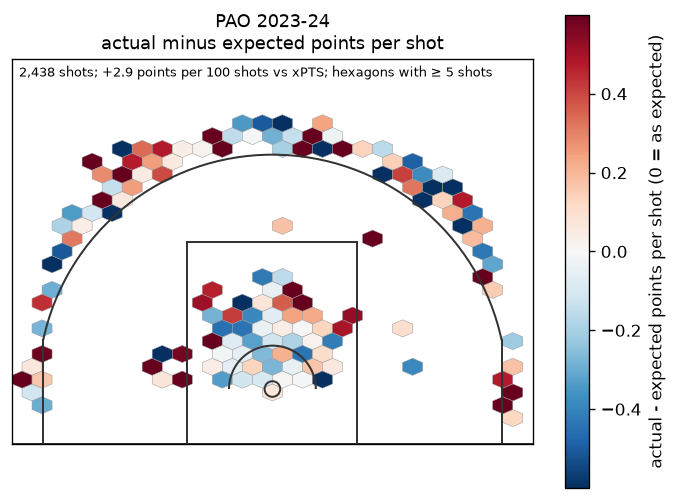
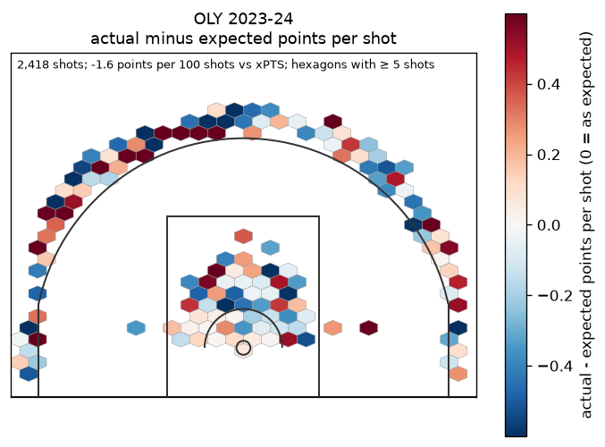
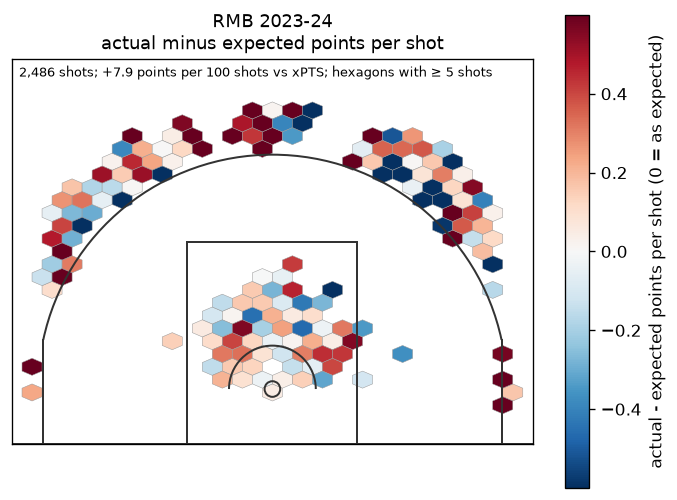
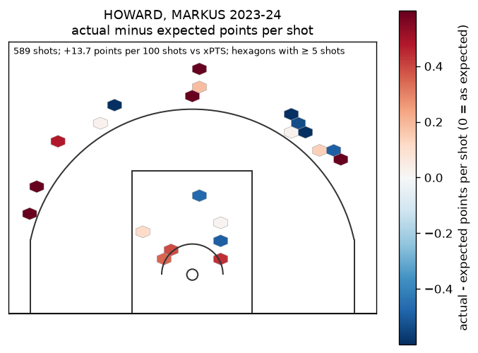
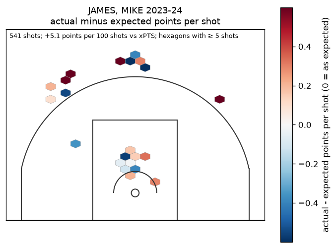
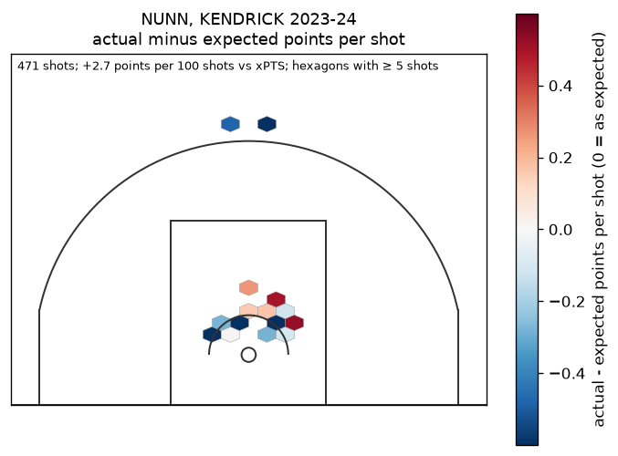

# Model card: M2, the EuroLeague shot-quality model (xPTS)

*Weeks 7–10 (PLAN §5.3). Code: `src/eurohoops/parse/shot_table.py`,
`src/eurohoops/parse/free_throws.py`, `src/eurohoops/models/xpts.py`,
`src/eurohoops/models/xpts_gbm.py`, `src/eurohoops/eval/m2_backtest.py`,
`src/eurohoops/eval/team_shot_quality.py`, `src/eurohoops/eval/shot_making.py`. Reports:
`reports/backtest_m2.json`, `reports/shots.json`, `reports/free_throws.json`,
`reports/m2_teams.json`, `reports/m2_players.json`. Every number below is copied from those
reports: the tables in "Numbers" name the JSON path of each value, and
`tests/test_model_card_m2.py` checks every table value, and every decimal in the prose, against
them. Decisions, the invalid first run and the verdict: `reports/week7-10_progress.md`.*

## What it does
M2 gives every EuroLeague field-goal attempt since 2011-12 a probability of going in, from where
and when it was taken, never from who took it (PLAN R9: quality is not skill). xPTS = P(make) ×
shot value. From it come team shot quality (offence and defence allowed), expected free-throw
points (a separate team-level model), total shot value, and a shrunk player shot-making measure
with a stability check. M2 feeds no live prediction and no site page.

## Data and exclusions
- **Shots:** the cached `Points` feed, one row per field-goal attempt (marts `shots`,
  `shots_excluded`; `docs/data/shots.md`). 612424 shots from 2007-08 to 2025-26; 1795 excluded
  with a reason (missing (0, 0) location, a 2/3 label contradicting the FIBA line by more than
  0.15 m, unparseable rows), at most 0.0053 of a validated season. Feed and box score agree on
  FGA and made-FG points for 0.9999 of 2011+ team-games (the one miss is a box score without a
  player).
- **Seasons (F-a):** development 2011-12 to 2022-23 (385604 shots, leave-one-season-out CV),
  validation 2023-24 (41198), test 2024-25 and 2025-26 (93119, scored once after the verdict).
  2007-10 coordinates fit neither three-point line: those shots stay in the table, unused.

## Features, and why no identity
Distance and |angle| from the basket, `ZONE`, 2 vs 3, seconds left in the period, period
(overtime as one level), the score margin before the shot from the shooter's side, home, and
season as a numeric trend. No shooter, team, opponent or game column (a guard and a test enforce
it): a model that knew the shooter would count shot-making as quality.

**Dropped after the first run: the feed's `FASTBREAK`, `SECOND_CHANCE` and
`POINTS_OFF_TURNOVER` flags.** They were declared features (F-b), but from 2015-16 the feed sets
them only on made shots (make rate when set: 0.998 in 2015-16, 1.000 in 2022-23). They are
scoring tags, i.e. the outcome. The first run used them and was invalid (its numbers are in the
progress file, never committed); the flags were removed before the second run, and the user
made the removal permanent (weeks 7–10b). Transition and put-back context could be rebuilt from
the play-by-play for makes and misses alike; that is not done here. A data audit guards against
the next such feature: no flag or level of either feature builder may have a make rate of 99%
or more (or 1% or less) on the development shots where it is set (checklist item 32; it also
runs at the start of every backtest).

## Variants and the search
Four declared variants (F-c), all reported:
- `spline`: logistic regression with natural cubic splines in distance for 2s and 3s separately
  plus the linear features, whitened design, fitted with numpy. Grid knots {4, 6, 8} × L2
  {1e-5, 1e-4, 1e-3} by pooled LOSO CV log loss: 8 knots, L2 0.0001.
- `lgbm`: LightGBM, deterministic, 6 threads, no early stopping. Optuna TPE (seed 20261001, 60
  trials, `n_jobs=1`) on pooled LOSO CV log loss: best trial 57 (CV 0.629734) with 15 leaves,
  learning rate 0.0183, 900 trees, 178 minimum child samples, feature fraction 0.955, bagging
  fraction 0.783, L2 0.140. The study ran on development seasons only; its result is stored in
  the report and reused.
- `spline_iso`, `lgbm_iso`: the same plus isotonic calibration. For development season s the
  calibrator is fitted on predictions for the other development seasons from models trained
  without s *and* that season (leave-two-out), so no out-of-fold value depends on its own season.
- LightGBM predictions are the mean of five seeds (F-l). Seed sd of validation log loss:
  0.000049; no single seed would flip the verdict.

## Results
| Variant | CV log loss | Validation log loss | Validation Brier | Validation ECE | Test log loss |
|---|---|---|---|---|---|
| spline | 0.631577 | 0.635097 | 0.223844 | 0.0092 | 0.635433 |
| spline_iso | 0.631513 | 0.635286 | 0.223827 | 0.0092 | 0.635587 |
| lgbm | 0.629699 | 0.633267 | 0.223071 | 0.0104 | 0.633467 |
| lgbm_iso | 0.629867 | 0.633333 | 0.223109 | 0.0116 | 0.633374 |

A constant league make rate scores about 0.69, so location and game state explain a modest
share of make and miss: there is no defender, shot type or shooter balance in this data.

**Gate (validation 2023-24): FAILED.** Challenger `lgbm` vs baseline `spline_iso` (each the
best of its family on CV): log loss −0.002019, game-level bootstrap 95% CI [−0.002910,
−0.001255]; Brier −0.000756 [−0.001027, −0.000509]. **It beats the baseline.** But the chosen M2
(`lgbm`) is **not calibrated** by F-f: ECE 0.0104 against the F-f target of 0.01, and two of 20
equal-count bins miss ±0.02 (mean P 0.401: +0.0338; mean P 0.694: −0.0236).

**Test (2024-25 + 2025-26, scored once after the verdict):** log loss −0.002119 [−0.002601,
−0.001658], Brier −0.000842 [−0.001034, −0.000654]; `lgbm` ECE 0.0126. Same picture: better
than the baseline, not calibrated.

## Calibration
| Split of validation | lgbm − spline_iso log loss | lgbm ECE |
|---|---|---|
| rim (< 1.5 m) | -0.00184 | 0.0149 |
| short (1.5-3 m) | -0.00087 | 0.0224 |
| mid (3-5 m) | -0.00423 | 0.0299 |
| long 2 (≥ 5 m) | -0.00066 | 0.0419 |
| three (< 8 m) | -0.00123 | 0.0147 |
| deep three (≥ 8 m) | -0.00944 | 0.0495 |
| 2s | -0.00188 | 0.0129 |
| 3s | -0.00222 | 0.0139 |

LightGBM is better than the spline in every band, and within every band its calibration is
worse than overall: per-band ECE reaches 0.0495 for deep threes. Hypothesis: league shooting
moves from season to season (the calibration-in-the-large ratios below range from 0.9766 to
1.0198), and a model fitted on other seasons cannot know a new season's level. Isotonic
calibration fitted on other seasons does not remove a level shift of the new season
(`lgbm_iso` validation ECE 0.0116).

## Free throws (F-e)
The shot feed has no free-throw attempts on missed shots, so free throws come from the
play-by-play. Fouls there are untyped: a trip can be tied to its shot only for **and-ones** (a
one-shot trip after the same team's made field goal at the same clock), which carry the shot's
distance band. All other trips (fouls on missed shots, bonus free throws, technicals) are
team-level. Development rates: and-one trips per FGA 0.0618 at the rim, 0.0372 short, 0.0032 on
threes, 0.735 points per and-one trip; other trips 0.1356 per FGA at 1.510 points per trip.

**The F2 check, re-specified by the user (2026-09-26): within-season shares. FAILED.** A
league-wide level shift cannot move a share, so the check asks what the model can know. Per
held-out season (development seasons leave-one-season-out, validation on all development
seasons): each distance band's share of the and-one FT points, and each team's share of the
league's per-game FT points, expected vs actual, each within 2 × its game-level bootstrap SE.
Twelve checks at 2 SE would flag a few by chance even for a right model, so band flags gate by a
count rule the user chose before the first run: at most 7 of 78 (the 95th percentile of
Binomial(78, 0.0455)). Result: **12 of 78 band checks flagged**, and the team check fails in
every season. The teams' mean absolute share gap stays within twice its noise scale everywhere
(e.g. 0.00783 against 0.00890 in 2017-18), but the expected shares do not track the actual
ones: Pearson r from −0.421 (2017-18) to 0.298 (2012-13), never above its 2-SE bar. Cause:
free-throw trips and FGA compete for possessions (a shooting foul on a miss ends a possession
with no FGA), so teams that take more shots do not draw more free throws, yet the model's
"other trips per FGA" assumes they do. The model knows a team's shot volume and mix, not its
foul drawing. A team-level FT model (trips per possession, foul drawing) would be the next step;
it is not built here.

**Limit (season level, not gated):** league FT points per team-game move between seasons (sd
0.66), so rates fitted on other seasons miss a season's level: the mean gap is within ±0.1 only
in 2018-19, 2019-20 and 2020-21 (e.g. 0.971 in 2011-12, −1.276 in 2021-22; validation −0.600).
This was the first F2 target (±0.1 development, ±0.2 validation); it is kept as a limitation.

## Team shot quality
Per team-game (mart `team_shot_quality`) and per team-season (`reports/m2_teams.json`): xPTS per
shot for and against, actual minus expected, expected FT points and total shot value, with
game-level bootstrap intervals. Out-of-fold xPTS only.

| 2023-24 | xPTS per shot | Actual − expected per shot | xPTS allowed per shot | Total shot value per game |
|---|---|---|---|---|
| Panathinaikos (PAO) | 1.101 | 0.029 | 1.124 | 78.8 |
| Olympiacos (OLY) | 1.130 | -0.016 | 1.093 | 79.9 |
| Real Madrid (RMB) | 1.072 | 0.079 | 1.037 | 82.6 |

**Calibration in the large misses the 0.5% target in 7 of 12 development seasons**
(xPTS / actual FG points from 0.9766 in 2013-14 to 1.0198 in 2019-20): the same season-level
shift as above. Team comparisons within a season are unaffected by a league-wide level; totals
across seasons are.

## Player shot-making and stability
Σ(actual − xPTS) per 100 shots with out-of-fold xPTS, empirical-Bayes shrinkage toward 0 (R11)
with the prior variance from 1605 development player-seasons of at least 100 FGA (prior sd 7.71
points per 100 shots; sampling variance by game-level bootstrap), 90% posterior intervals; shown
for at least 100 FGA (`reports/m2_players.json`). Discrimination (R10): 0.441 of the spread
across players is signal; sd 11.61 raw, 5.49 shrunk.

**Stability (F-k, fixed before any player number existed): stable enough to show.** Year-to-year
r of shrunk shot-making over 235 player pairs with at least 200 FGA in consecutive development
seasons: 0.396, 90% CI [0.311, 0.481] (rule: lower bound ≥ 0.20). Split-half (odd vs even
games, 595 player-seasons): 0.315 (rule: ≥ 0.30, met narrowly). For comparison, raw eFG% has
year-to-year r 0.446 [0.343, 0.533] and raw FG% 0.672 [0.577, 0.740]: raw percentages repeat
more because they mostly repeat a player's shot *selection* (a centre's FG% is high every year),
which shot-making removes.

## Shot charts
Validation season 2023-24, out-of-sample xPTS from the development-fitted `lgbm`; court drawn
from the `parse/shots.py` FIBA constants; hexagons with at least 5 shots.

## Limitations and what failed
- **Exit gate not met:** M2 beats the spline baseline on validation and test, but it is not
  calibrated to the F-f target, so the gate failed. It is still the best available estimate of
  shot quality here; read xPTS levels across seasons with care.
- **Outcome-coded context flags** were in the declared feature set and had to be removed; the
  first run is invalid and is kept only in the progress file.
- **Free throws:** season-level variation defeats the ±0.1 reconciliation target.
- **Runtime:** the backtest (five seeds, nested isotonic) takes about 49 minutes locally, over
  the 40-minute budget.
- No tracking data: defender distance, shot type and shooter balance are invisible, which caps
  what any location model can explain.
- Player charts are sparse at 5 shots per hexagon; one season is a small sample for one player.

## Numbers
### Data
| Number | Value | Source |
|---|---|---|
| Shots in the table (2007-08 to 2025-26) | 612424 | `shots.json:shots` |
| Shots excluded | 1795 | `shots.json:excluded` |
| Feed = box score, 2011+ team-games | 0.9999 | `shots.json:reconciliation_match_rate_validated` |
| Excluded share 2011 | 0.0053 | `shots.json:seasons.2011.excluded_share` |
| Excluded share 2023 | 0.0032 | `shots.json:seasons.2023.excluded_share` |
| Second-chance flag: make rate when set, 2015 | 0.998 | `shots.json:seasons.2015.outcome_coded_flags.second_chance.make_rate_when_set` |
| Second-chance flag: make rate when set, 2022 | 1.000 | `shots.json:seasons.2022.outcome_coded_flags.second_chance.make_rate_when_set` |
| Development shots | 385604 | `backtest_m2.json:shots.development` |
| Validation shots | 41198 | `backtest_m2.json:shots.validation` |
| Test shots | 93119 | `backtest_m2.json:shots.test` |

### Search and chosen hyperparameters
| Number | Value | Source |
|---|---|---|
| Spline knots (by CV) | 8 | `backtest_m2.json:spline_chosen.knots` |
| Spline L2 (by CV) | 0.0001 | `backtest_m2.json:spline_chosen.l2` |
| Optuna trials | 60 | `backtest_m2.json:optuna_study.n_trials` |
| Optuna best trial | 57 | `backtest_m2.json:optuna_study.best_trial` |
| Optuna best CV log loss | 0.629734 | `backtest_m2.json:optuna_study.best_value` |
| LightGBM num_leaves | 15 | `backtest_m2.json:lightgbm_params.num_leaves` |
| LightGBM learning_rate | 0.0183 | `backtest_m2.json:lightgbm_params.learning_rate` |
| LightGBM n_estimators | 900 | `backtest_m2.json:lightgbm_params.n_estimators` |
| LightGBM min_child_samples | 178 | `backtest_m2.json:lightgbm_params.min_child_samples` |
| LightGBM feature_fraction | 0.955 | `backtest_m2.json:lightgbm_params.feature_fraction` |
| LightGBM bagging_fraction | 0.783 | `backtest_m2.json:lightgbm_params.bagging_fraction` |
| LightGBM lambda_l2 | 0.140 | `backtest_m2.json:lightgbm_params.lambda_l2` |

### Variants
| Number | Value | Source |
|---|---|---|
| spline cv log_loss | 0.631577 | `backtest_m2.json:variants.spline.cv.log_loss` |
| spline cv brier | 0.221987 | `backtest_m2.json:variants.spline.cv.brier` |
| spline cv ece | 0.0040 | `backtest_m2.json:variants.spline.cv.ece` |
| spline validation log_loss | 0.635097 | `backtest_m2.json:variants.spline.validation.log_loss` |
| spline validation brier | 0.223844 | `backtest_m2.json:variants.spline.validation.brier` |
| spline validation ece | 0.0092 | `backtest_m2.json:variants.spline.validation.ece` |
| spline test log_loss | 0.635433 | `backtest_m2.json:variants.spline.test.log_loss` |
| spline test brier | 0.223662 | `backtest_m2.json:variants.spline.test.brier` |
| spline test ece | 0.0119 | `backtest_m2.json:variants.spline.test.ece` |
| spline_iso cv log_loss | 0.631513 | `backtest_m2.json:variants.spline_iso.cv.log_loss` |
| spline_iso cv brier | 0.221970 | `backtest_m2.json:variants.spline_iso.cv.brier` |
| spline_iso cv ece | 0.0026 | `backtest_m2.json:variants.spline_iso.cv.ece` |
| spline_iso validation log_loss | 0.635286 | `backtest_m2.json:variants.spline_iso.validation.log_loss` |
| spline_iso validation brier | 0.223827 | `backtest_m2.json:variants.spline_iso.validation.brier` |
| spline_iso validation ece | 0.0092 | `backtest_m2.json:variants.spline_iso.validation.ece` |
| spline_iso test log_loss | 0.635587 | `backtest_m2.json:variants.spline_iso.test.log_loss` |
| spline_iso test brier | 0.223667 | `backtest_m2.json:variants.spline_iso.test.brier` |
| spline_iso test ece | 0.0120 | `backtest_m2.json:variants.spline_iso.test.ece` |
| lgbm cv log_loss | 0.629699 | `backtest_m2.json:variants.lgbm.cv.log_loss` |
| lgbm cv brier | 0.221223 | `backtest_m2.json:variants.lgbm.cv.brier` |
| lgbm cv ece | 0.0031 | `backtest_m2.json:variants.lgbm.cv.ece` |
| lgbm validation log_loss | 0.633267 | `backtest_m2.json:variants.lgbm.validation.log_loss` |
| lgbm validation brier | 0.223071 | `backtest_m2.json:variants.lgbm.validation.brier` |
| lgbm validation ece | 0.0104 | `backtest_m2.json:variants.lgbm.validation.ece` |
| lgbm test log_loss | 0.633467 | `backtest_m2.json:variants.lgbm.test.log_loss` |
| lgbm test brier | 0.222825 | `backtest_m2.json:variants.lgbm.test.brier` |
| lgbm test ece | 0.0126 | `backtest_m2.json:variants.lgbm.test.ece` |
| lgbm_iso cv log_loss | 0.629867 | `backtest_m2.json:variants.lgbm_iso.cv.log_loss` |
| lgbm_iso cv brier | 0.221262 | `backtest_m2.json:variants.lgbm_iso.cv.brier` |
| lgbm_iso cv ece | 0.0022 | `backtest_m2.json:variants.lgbm_iso.cv.ece` |
| lgbm_iso validation log_loss | 0.633333 | `backtest_m2.json:variants.lgbm_iso.validation.log_loss` |
| lgbm_iso validation brier | 0.223109 | `backtest_m2.json:variants.lgbm_iso.validation.brier` |
| lgbm_iso validation ece | 0.0116 | `backtest_m2.json:variants.lgbm_iso.validation.ece` |
| lgbm_iso test log_loss | 0.633374 | `backtest_m2.json:variants.lgbm_iso.test.log_loss` |
| lgbm_iso test brier | 0.222771 | `backtest_m2.json:variants.lgbm_iso.test.brier` |
| lgbm_iso test ece | 0.0119 | `backtest_m2.json:variants.lgbm_iso.test.ece` |

### Gate (validation) and test
| Number | Value | Source |
|---|---|---|
| gate log_loss_challenger_minus_baseline mean | -0.002019 | `backtest_m2.json:gate.log_loss_challenger_minus_baseline.mean` |
| gate log_loss_challenger_minus_baseline CI low | -0.002910 | `backtest_m2.json:gate.log_loss_challenger_minus_baseline.ci95.0` |
| gate log_loss_challenger_minus_baseline CI high | -0.001255 | `backtest_m2.json:gate.log_loss_challenger_minus_baseline.ci95.1` |
| gate brier_challenger_minus_baseline mean | -0.000756 | `backtest_m2.json:gate.brier_challenger_minus_baseline.mean` |
| gate brier_challenger_minus_baseline CI low | -0.001027 | `backtest_m2.json:gate.brier_challenger_minus_baseline.ci95.0` |
| gate brier_challenger_minus_baseline CI high | -0.000509 | `backtest_m2.json:gate.brier_challenger_minus_baseline.ci95.1` |
| gate ECE difference | 0.0012 | `backtest_m2.json:gate.ece_challenger_minus_baseline.mean` |
| gate challenger | lgbm | `backtest_m2.json:gate.challenger` |
| gate baseline | spline_iso | `backtest_m2.json:gate.baseline` |
| gate chosen | lgbm | `backtest_m2.json:gate.chosen` |
| test_gate log_loss_challenger_minus_baseline mean | -0.002119 | `backtest_m2.json:test_gate.log_loss_challenger_minus_baseline.mean` |
| test_gate log_loss_challenger_minus_baseline CI low | -0.002601 | `backtest_m2.json:test_gate.log_loss_challenger_minus_baseline.ci95.0` |
| test_gate log_loss_challenger_minus_baseline CI high | -0.001658 | `backtest_m2.json:test_gate.log_loss_challenger_minus_baseline.ci95.1` |
| test_gate brier_challenger_minus_baseline mean | -0.000842 | `backtest_m2.json:test_gate.brier_challenger_minus_baseline.mean` |
| test_gate brier_challenger_minus_baseline CI low | -0.001034 | `backtest_m2.json:test_gate.brier_challenger_minus_baseline.ci95.0` |
| test_gate brier_challenger_minus_baseline CI high | -0.000654 | `backtest_m2.json:test_gate.brier_challenger_minus_baseline.ci95.1` |
| test_gate ECE difference | 0.0006 | `backtest_m2.json:test_gate.ece_challenger_minus_baseline.mean` |
| test_gate challenger | lgbm | `backtest_m2.json:test_gate.challenger` |
| test_gate baseline | spline_iso | `backtest_m2.json:test_gate.baseline` |
| test_gate chosen | lgbm | `backtest_m2.json:test_gate.chosen` |
| lgbm 5 seeds cv_log_loss mean | 0.629740 | `backtest_m2.json:seed_robustness.summary.lgbm.cv_log_loss.mean_of_seeds` |
| lgbm 5 seeds cv_log_loss sd | 0.000020 | `backtest_m2.json:seed_robustness.summary.lgbm.cv_log_loss.sd` |
| lgbm 5 seeds validation_log_loss mean | 0.633300 | `backtest_m2.json:seed_robustness.summary.lgbm.validation_log_loss.mean_of_seeds` |
| lgbm 5 seeds validation_log_loss sd | 0.000049 | `backtest_m2.json:seed_robustness.summary.lgbm.validation_log_loss.sd` |
| lgbm_iso 5 seeds cv_log_loss mean | 0.629901 | `backtest_m2.json:seed_robustness.summary.lgbm_iso.cv_log_loss.mean_of_seeds` |
| lgbm_iso 5 seeds cv_log_loss sd | 0.000023 | `backtest_m2.json:seed_robustness.summary.lgbm_iso.cv_log_loss.sd` |
| lgbm_iso 5 seeds validation_log_loss mean | 0.633398 | `backtest_m2.json:seed_robustness.summary.lgbm_iso.validation_log_loss.mean_of_seeds` |
| lgbm_iso 5 seeds validation_log_loss sd | 0.000028 | `backtest_m2.json:seed_robustness.summary.lgbm_iso.validation_log_loss.sd` |
| lgbm validation bin 9 mean P | 0.401 | `backtest_m2.json:variants.lgbm.validation.reliability.9.mean_p` |
| lgbm validation bin 9 gap | 0.0338 | `backtest_m2.json:variants.lgbm.validation.reliability.9.gap` |
| lgbm validation bin 17 mean P | 0.694 | `backtest_m2.json:variants.lgbm.validation.reliability.17.mean_p` |
| lgbm validation bin 17 gap | -0.0236 | `backtest_m2.json:variants.lgbm.validation.reliability.17.gap` |
| Validation diff by band: rim | -0.00184 | `backtest_m2.json:gate.diff_breakdown.by_band.rim.mean` |
| lgbm validation ECE rim | 0.0149 | `backtest_m2.json:variants.lgbm.validation.by_band.rim.ece` |
| Validation diff by band: short | -0.00087 | `backtest_m2.json:gate.diff_breakdown.by_band.short.mean` |
| lgbm validation ECE short | 0.0224 | `backtest_m2.json:variants.lgbm.validation.by_band.short.ece` |
| Validation diff by band: mid | -0.00423 | `backtest_m2.json:gate.diff_breakdown.by_band.mid.mean` |
| lgbm validation ECE mid | 0.0299 | `backtest_m2.json:variants.lgbm.validation.by_band.mid.ece` |
| Validation diff by band: long2 | -0.00066 | `backtest_m2.json:gate.diff_breakdown.by_band.long2.mean` |
| lgbm validation ECE long2 | 0.0419 | `backtest_m2.json:variants.lgbm.validation.by_band.long2.ece` |
| Validation diff by band: three | -0.00123 | `backtest_m2.json:gate.diff_breakdown.by_band.three.mean` |
| lgbm validation ECE three | 0.0147 | `backtest_m2.json:variants.lgbm.validation.by_band.three.ece` |
| Validation diff by band: deep3 | -0.00944 | `backtest_m2.json:gate.diff_breakdown.by_band.deep3.mean` |
| lgbm validation ECE deep3 | 0.0495 | `backtest_m2.json:variants.lgbm.validation.by_band.deep3.ece` |
| Validation diff 2pt | -0.00188 | `backtest_m2.json:gate.diff_breakdown.by_type.2pt.mean` |
| lgbm validation ECE 2pt | 0.0129 | `backtest_m2.json:variants.lgbm.validation.by_type.2pt.ece` |
| Validation diff 3pt | -0.00222 | `backtest_m2.json:gate.diff_breakdown.by_type.3pt.mean` |
| lgbm validation ECE 3pt | 0.0139 | `backtest_m2.json:variants.lgbm.validation.by_type.3pt.ece` |

### Free throws
| Number | Value | Source |
|---|---|---|
| And-one trips per FGA, rim | 0.0618 | `free_throws.json:rates_development.and_one_trips_per_fga.rim` |
| And-one trips per FGA, short | 0.0372 | `free_throws.json:rates_development.and_one_trips_per_fga.short` |
| And-one trips per FGA, three | 0.0032 | `free_throws.json:rates_development.and_one_trips_per_fga.three` |
| Points per and-one trip | 0.735 | `free_throws.json:rates_development.points_per_and_one_trip` |
| Other trips per FGA | 0.1356 | `free_throws.json:rates_development.other_trips_per_fga` |
| Points per other trip | 1.510 | `free_throws.json:rates_development.points_per_other_trip` |
| Between-season sd of FT points per team-game | 0.66 | `free_throws.json:season_ft_points_sd_development` |
| FT mean gap 2011 | 0.971 | `free_throws.json:seasons.2011.mean_gap` |
| FT mean gap 2012 | -0.129 | `free_throws.json:seasons.2012.mean_gap` |
| FT mean gap 2013 | -0.954 | `free_throws.json:seasons.2013.mean_gap` |
| FT mean gap 2014 | -0.124 | `free_throws.json:seasons.2014.mean_gap` |
| FT mean gap 2015 | 0.203 | `free_throws.json:seasons.2015.mean_gap` |
| FT mean gap 2016 | -0.233 | `free_throws.json:seasons.2016.mean_gap` |
| FT mean gap 2017 | 0.889 | `free_throws.json:seasons.2017.mean_gap` |
| FT mean gap 2018 | -0.011 | `free_throws.json:seasons.2018.mean_gap` |
| FT mean gap 2019 | -0.100 | `free_throws.json:seasons.2019.mean_gap` |
| FT mean gap 2020 | -0.014 | `free_throws.json:seasons.2020.mean_gap` |
| FT mean gap 2021 | -1.276 | `free_throws.json:seasons.2021.mean_gap` |
| FT mean gap 2022 | 0.953 | `free_throws.json:seasons.2022.mean_gap` |
| FT mean gap 2023 | -0.600 | `free_throws.json:seasons.2023.mean_gap` |
| F2 share gate band checks | 78 | `free_throws.json:share_check.band_checks` |
| F2 share gate band flags | 12 | `free_throws.json:share_check.band_flags` |
| F2 share gate band flags allowed | 7 | `free_throws.json:share_check.band_flags_allowed` |
| F2 band flag rate of a right model | 0.0455 | `free_throws.json:share_check.band_flag_rate_if_right` |
| F2 team mean abs share gap 2017 | 0.00783 | `free_throws.json:seasons.2017.shares.teams.mean_abs_share_gap` |
| F2 team mean abs gap tolerance 2017 | 0.00890 | `free_throws.json:seasons.2017.shares.teams.mean_abs_tolerance` |
| F2 team share r 2011 | 0.136 | `free_throws.json:seasons.2011.shares.teams.pearson_r` |
| F2 team share r 2012 | 0.298 | `free_throws.json:seasons.2012.shares.teams.pearson_r` |
| F2 team share r 2013 | -0.186 | `free_throws.json:seasons.2013.shares.teams.pearson_r` |
| F2 team share r 2014 | 0.148 | `free_throws.json:seasons.2014.shares.teams.pearson_r` |
| F2 team share r 2015 | 0.228 | `free_throws.json:seasons.2015.shares.teams.pearson_r` |
| F2 team share r 2016 | 0.203 | `free_throws.json:seasons.2016.shares.teams.pearson_r` |
| F2 team share r 2017 | -0.421 | `free_throws.json:seasons.2017.shares.teams.pearson_r` |
| F2 team share r 2018 | -0.211 | `free_throws.json:seasons.2018.shares.teams.pearson_r` |
| F2 team share r 2019 | 0.253 | `free_throws.json:seasons.2019.shares.teams.pearson_r` |
| F2 team share r 2020 | -0.103 | `free_throws.json:seasons.2020.shares.teams.pearson_r` |
| F2 team share r 2021 | -0.036 | `free_throws.json:seasons.2021.shares.teams.pearson_r` |
| F2 team share r 2022 | -0.055 | `free_throws.json:seasons.2022.shares.teams.pearson_r` |
| F2 team share r 2023 | 0.152 | `free_throws.json:seasons.2023.shares.teams.pearson_r` |
| F2 team share r 2-SE bar 2017 | 0.256 | `free_throws.json:seasons.2017.shares.teams.r_tolerance` |

### Team shot quality
| Number | Value | Source |
|---|---|---|
| xPTS / actual FG points 2011 | 0.9967 | `m2_teams.json:calibration_in_the_large.2011.ratio` |
| xPTS / actual FG points 2012 | 1.0077 | `m2_teams.json:calibration_in_the_large.2012.ratio` |
| xPTS / actual FG points 2013 | 0.9766 | `m2_teams.json:calibration_in_the_large.2013.ratio` |
| xPTS / actual FG points 2014 | 1.0016 | `m2_teams.json:calibration_in_the_large.2014.ratio` |
| xPTS / actual FG points 2015 | 0.9807 | `m2_teams.json:calibration_in_the_large.2015.ratio` |
| xPTS / actual FG points 2016 | 0.9865 | `m2_teams.json:calibration_in_the_large.2016.ratio` |
| xPTS / actual FG points 2017 | 1.0028 | `m2_teams.json:calibration_in_the_large.2017.ratio` |
| xPTS / actual FG points 2018 | 0.9905 | `m2_teams.json:calibration_in_the_large.2018.ratio` |
| xPTS / actual FG points 2019 | 1.0198 | `m2_teams.json:calibration_in_the_large.2019.ratio` |
| xPTS / actual FG points 2020 | 0.9907 | `m2_teams.json:calibration_in_the_large.2020.ratio` |
| xPTS / actual FG points 2021 | 1.0054 | `m2_teams.json:calibration_in_the_large.2021.ratio` |
| xPTS / actual FG points 2022 | 0.9968 | `m2_teams.json:calibration_in_the_large.2022.ratio` |
| MAD 2023 xPTS per shot | 1.072 | `m2_teams.json:team_seasons.245.offence.xpts_per_shot.mean` |
| MAD 2023 actual - expected per shot | 0.079 | `m2_teams.json:team_seasons.245.offence.actual_minus_expected_per_shot.mean` |
| MAD 2023 xPTS allowed per shot | 1.037 | `m2_teams.json:team_seasons.245.defence.xpts_allowed_per_shot.mean` |
| MAD 2023 total shot value per game | 82.6 | `m2_teams.json:team_seasons.245.per_game.total_shot_value.mean` |
| OLY 2023 xPTS per shot | 1.130 | `m2_teams.json:team_seasons.249.offence.xpts_per_shot.mean` |
| OLY 2023 actual - expected per shot | -0.016 | `m2_teams.json:team_seasons.249.offence.actual_minus_expected_per_shot.mean` |
| OLY 2023 xPTS allowed per shot | 1.093 | `m2_teams.json:team_seasons.249.defence.xpts_allowed_per_shot.mean` |
| OLY 2023 total shot value per game | 79.9 | `m2_teams.json:team_seasons.249.per_game.total_shot_value.mean` |
| PAN 2023 xPTS per shot | 1.101 | `m2_teams.json:team_seasons.251.offence.xpts_per_shot.mean` |
| PAN 2023 actual - expected per shot | 0.029 | `m2_teams.json:team_seasons.251.offence.actual_minus_expected_per_shot.mean` |
| PAN 2023 xPTS allowed per shot | 1.124 | `m2_teams.json:team_seasons.251.defence.xpts_allowed_per_shot.mean` |
| PAN 2023 total shot value per game | 78.8 | `m2_teams.json:team_seasons.251.per_game.total_shot_value.mean` |

### Player shot-making
| Number | Value | Source |
|---|---|---|
| Prior sd (per 100 shots) | 7.71 | `m2_players.json:prior.sd` |
| Player-seasons in the prior | 1605 | `m2_players.json:prior.player_seasons` |
| Signal share | 0.441 | `m2_players.json:discrimination.signal_share` |
| sd raw | 11.61 | `m2_players.json:discrimination.sd_raw` |
| sd shrunk | 5.49 | `m2_players.json:discrimination.sd_shrunk` |
| Year-to-year pairs | 235 | `m2_players.json:stability.year_to_year.pairs` |
| Year-to-year r shrunk_shot_making | 0.396 | `m2_players.json:stability.year_to_year.shrunk_shot_making.r` |
| Year-to-year 90% CI low shrunk_shot_making | 0.311 | `m2_players.json:stability.year_to_year.shrunk_shot_making.ci90.0` |
| Year-to-year 90% CI high shrunk_shot_making | 0.481 | `m2_players.json:stability.year_to_year.shrunk_shot_making.ci90.1` |
| Year-to-year r raw_efg_pct | 0.446 | `m2_players.json:stability.year_to_year.raw_efg_pct.r` |
| Year-to-year 90% CI low raw_efg_pct | 0.343 | `m2_players.json:stability.year_to_year.raw_efg_pct.ci90.0` |
| Year-to-year 90% CI high raw_efg_pct | 0.533 | `m2_players.json:stability.year_to_year.raw_efg_pct.ci90.1` |
| Year-to-year r raw_fg_pct | 0.672 | `m2_players.json:stability.year_to_year.raw_fg_pct.r` |
| Year-to-year 90% CI low raw_fg_pct | 0.577 | `m2_players.json:stability.year_to_year.raw_fg_pct.ci90.0` |
| Year-to-year 90% CI high raw_fg_pct | 0.740 | `m2_players.json:stability.year_to_year.raw_fg_pct.ci90.1` |
| Split-half r | 0.315 | `m2_players.json:stability.split_half.r` |
| Split-half player-seasons | 595 | `m2_players.json:stability.split_half.player_seasons` |
| Verdict | stable enough to show | `m2_players.json:stability.verdict` |
